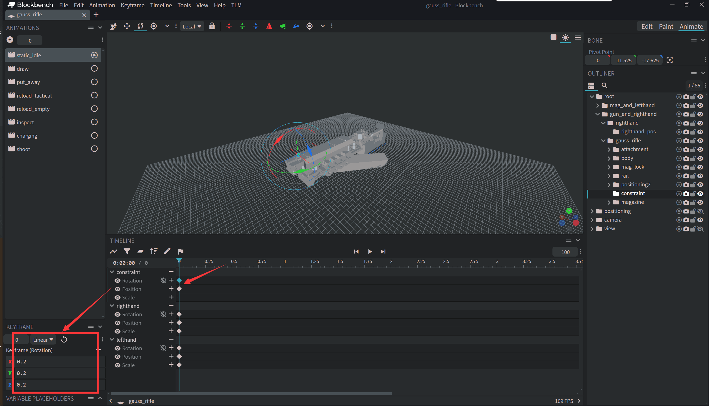

# Animation Constraint (ICA)

> The role of the animation constraint group is as follows: When the animation is played **ads**, the common coordinates of this group will not change as much as possible and the common rotation will be weakened as much as possible. The degree of weakening of displacement and rotation is determined by animation data of ica group.

## Add Constraint Group
Create a new group "constraint" under the gun model group and place the group at the position of the iron sight front.

## Add Constraint Group Keyframe
Set the data of rotation and translation axes of the "constraint" node to 0.2 under the static_idle animation.

Explanation: The animation value of the constraint can be 0-1, representing 0% - 100% of the animation freedom. In other words, if it is set to 0, the animation will not be able to affect the common coordinates or rotation of the constraint group at all and will remain stationary. If it is set to 1, the animation will not be affected.

It is recommended to use 0.2 here.

## Adding constraints to the shooting animation
Sometimes, a constraint value of 0.2 is too small for a shooting animation. You can temporarily increase the constraint value during the gun movement of the shooting animation and set the constraint value back to 0 at the end.
