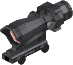

# Low-Poly Models to Reduce Rendering Load

Due to the generally high precision of gun models, models with hundreds of blocks can bring significant rendering pressure to the game. This is especially true when many players like to hang guns on the wall, which can lead to very high performance usage when many guns are displayed. To mitigate this issue, we can use low-poly models for display. Low-poly models are not mandatory but are recommended to reduce game pressure.
::: tip
Applicable scenarios for low-poly models: third-person holding, item frames, and as dropped items on the ground; Applicable scenarios for high-poly models: first-person holding and rotating display in the gun crafting table.
:::

## Low-Poly Gun Models


::: tip

The number of blocks in a low-poly model should not be too many; keeping it under 50 is ideal. Low-poly gun model should also retain their positioning groups. [Adjust gun model positioning groups](/zh/gunpack/gun_positioning/)

:::
When you have completed the modeling of the low-poly model, export the Bedrock edition model and related textures. Here we use the M4A1 as an example.
::: tip
When creating your own low-poly model, avoid confusing the names with high-poly models. It is recommended to add the suffix "_lod" to both the model and texture of the low-poly model.
:::

### Modeling for LOD

A recommended method is to copy the high-poly model and then simplify it accordingly.

::: tip
Low-poly models should also retain all positioning groups.
[Adjusting Gun Model Positioning Groups](/gunpack/gun_positioning/)
Since it is not rendered in the first-person view, the first-person arm positioning group is not needed.
:::

### Setting LOD for Gun

At this point, you should have the following resources:

- Low-poly model: m4a1_geo.json
- Texture: m4a1.png

1. Find the models/gun directory and create a new folder named lod, then place m4a1_geo.json inside.
2. Find the textures/gun directory and create a new folder named lod, then place m4a1.png inside.

Your directory structure should now look like this:

```
tutorial_gun_pack
└─ tutorial
   ├─ textures
   │  └─ gun
   │     └─ lod
   │        └─ m4a1.png
   └─ models
      └─ gun
         └─ lod
            └─ m4a1_geo.json
```


### Modifying the Gun Display File

Find your gun display file (in the guns/display directory). Using m4a1 as an example, find m4a1_display.json and add the following content:

```json
// Calling the low-poly model
"lod": {
    // Path to your low-poly model
    "model": "tutorial:gun/lod/m4a1_geo",
    // Path to your low-poly model texture
    "texture": "tutorial:gun/lod/m4a1"
}

```

After doing this, start the game (or use /tacz reload in-game).
If you see the following screen, it means the low-poly model has been successfully added.


## Low-Poly model of Accessories


Here we take acog as an example. (left: normal model; right: low-poly model)

### Modeling accessory LOD

The process is similar to gun LOD
::: tip
The Low-poly model of the scope does not need 'division' or 'ocular' node, only the main body is needed.
:::

### Setting LOD for accessory

At this time, you should already have the following resources:

- Low-poly model: scope_acog_ta31_lod.json
- Texture: scope_acog_ta31_lod.png

1. Find the models/attachment directory, create a new folder lod, and put scope_acog_ta31_lod.json in it

2. Find the textures/attachment directory, create a new folder lod, and put scope_acog_ta31_lod.png in it

After you following the steps above, your gun pack folder view should be like this:

```
tutorial_gun_pack
└─ tutorial
   ├─ textures
   │  ├─ attachment
   │     └─ lod
   │        └─ scope_acog_ta31_lod.png
   └─ models
      └─ attachment
         └─ lod
            └─ scope_acog_ta31_lod.json
```

### Modify accessory Display Files

Find your accessory display file (under the attachments/display directory). Here we still take acog as an example. Find scope_acog_ta31_display.json and add the following content to it:

```json
"lod": {
  //Your low-poly model path
  "model": "tutorial:attachment/lod/scope_acog_ta31_lod",
  //Your low-poly texture path
  "texture": "tutorial:attachment/lod/scope_acog_ta31_lod"
}
```

Start the game after doing this (or use /tacz reload in the game).
If you see the following screen, it means that the low-precision model of the accessory has been added successfully.


## Global control of low-precision models

Finally, if you happen to have the Cloth Config mod installed, you can press alt + T in the game to open the configuration menu. Here, you can set the rendering distance for the low-poly model (in blocks). Within this distance, the high-poly model is rendered; beyond this distance, the low-poly model is rendered.

