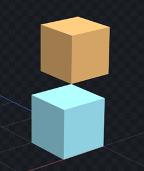
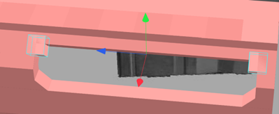

# Part Two · Creating Your Project
## Preparation
**We assume you are already familiar with the basic modeling operations in Blockbench, such as using basic hotkeys and understanding functionalities. If not, please [click here](https://youtu.be/XqzxL_-XjA0) to review the basic operations.**

To ensure that the models you submit match the various model scales used by the MOD by default, we require you to know the real-world data of the gun you are creating, such as the total length. This data can be found through a Google search or on the respective official websites.

Please note that different models of the same gun may have different lengths, and folding/extending gun parts can also change the total length of the reference image. Make sure your reference image matches your data.

For guns, we use the following ratio as the standard model ratio: **1000mm = 48 grid**.
For example, a 1000mm rifle can be calculated as follows:
x = 48 * L / 1000
where x represents the grid length and L is the actual total length.

**To make your work more accurate, we require you to import a side view of the gun as a reference.**

**Example Tutorial:**
For example, to build an HM 50B rifle, we first need to find a .png file. You can find a suitable side view on Google or other search engines:

**Please crop the reference photo to remove any white space on the left and right sides (no white space between the gun muzzle and stock and the image borders).**
After conversion, the total model length should be 70 grid. We will create a reference block plane in the project to place the reference image.
> Tips: Note that the plane's direction should have the long side facing north-south.

Next, adjust the reference block's aspect ratio according to the image resolution to keep the proportions consistent and avoid stretching.
> For example, if the image resolution is 1332 x 700, the block's corresponding aspect ratio is 60 x 31.5315.
> Then, drag the .png file to the desired plane and maximize the UV to cover the entire plane with the texture.

Click the axis point at the bottom right to make the view parallel to the selected normal.

Before starting construction, go to the outline view, click [More Options], and select [Lock] to make the reference block unselectable, avoiding accidental moves.

After completing the above steps, you can now observe your reference image and start building.
> Tips: You can also use Blockbench's built-in reference image feature to add references from other angles, but the main reference image for modeling must use block textures for more accurate references.

> 

## Building Explanation (Partial)
Now, press Ctrl+N to create your first cube model.
**Note that your model must be symmetrical about the Z-Y plane, meaning the anchored cube you create must be on the central axis N↑. Ensuring the model is symmetrical about the central axis helps standardize construction.**

**The gun barrel must face the N↑ direction.**

You can select the block and click the Center X Axis button to ensure the block is on the central axis.

We recommend adjusting the block size in multiples of **0.125** for uniform UV pixel size and easier alignment through move and scale operations when generating UVs.

By observing the structure, we can see that the gun consists of several basic parts:

Therefore, we first use different colored blocks to classify the structural parts of the gun.
> Tips: Select an existing block and press Ctrl+D to quickly duplicate it. Hold Alt and drag the block handles to increase the volume on both sides simultaneously.

Next, each part will have its skeleton and be named accordingly.

In the side view, press Ctrl and left-click to frame select, use Ctrl+G to quickly place the blocks into a skeleton.
You can also manually drag the blocks into the specified skeleton in the outline view. Select the skeleton and press F2 to quickly rename it.

Now that we have classified and skeletonized all volumes, we can start detailing each structural part.

For bones that do not need modification, you can hide them in the outline view by clicking the visibility icon (eye) or by holding Shift + left-click to select the bones you want to display and then pressing the hotkey I to hide all unselected bones.

How to determine the width of gun parts? We can cross-reference and compare with structures that have standard dimensions on the gun, such as the rail and grip:

The rail's base width in the model is always 0.75 grid, and the grip's usual width is between 1.5-2 grids, allowing you to estimate the approximate width of other parts.

In summary, do not rely too much on the side view during the modeling process. Actively seek more images from different angles for reference to restore the overall proportions of the gun.

Blockbench's vertex snapping feature can align the edges/vertices of blocks without creating gaps.

**The move function can move the entire block to the selected vertex.**

**The scale function can adjust the block volume to the selected vertex.**

You can also use vertex snapping to move pivot points, allowing you to place the pivot on the block's edge for rotation around that edge.

> Tips: To connect sloped surfaces, use vertex snapping in **scale mode**. In this mode, the block is automatically stretched to overlap the vertices, which is very effective for creating 45-degree chamfers.

> 

> 

> Tips: Copying and transforming existing blocks is faster than creating new ones, as it eliminates the need for extra dragging and maintains consistent colors for skeletons.

> 

> 

> 

> Tips: Placing the cube's center pivot on the right angle and then rotating helps create well-covered chamfers.

> 

> 

> Tips: Pressing Ctrl, Shift, and Ctrl+Shift while rotating allows you to rotate at different angle intervals. To create chamfers on sloped surfaces, copy the sloped block and perform the same chamfer operation.

> 

> 

In this part, the top also includes a rail.
Rails must be built to a uniform standard (this standard applies to the 48/1000 mm ratio):

Regarding rail construction, for optimization purposes, we will subjectively handle it.

Typically, using 0.25 as a rail unit with a 0.25-unit gap, 1-3-1 and 1-5-1 are common rail constructions, with the latter usually used for longer rails. We recommend using the 1-5-1 rail more often for better optimization.

Of course, adopting Weaver rail style can also effectively reduce the number of faces.

Finally, modify the details in various parts to complete the construction of this component:

**Special Movable Part: Bipod**
Since the bipod rotates around an axis that may be inclined, we need to use the skeleton rotation axis to complete it.

When creating the bipod model, you need to create a single leg model in a vertical or horizontal direction without any rotation.

Put all parts of the model into a newly created skeleton. Select the pivot of this skeleton and adjust it to the rotation axis of the bipod stand.

Next, rotate the skeleton along the Z-axis (blue) to align its rotation axis with the desired plane.

Then rotate along the X-axis (red) to get a properly bound bipod.

The other leg can be obtained by duplicating the current skeleton with Ctrl+D and flipping the X-axis.

After completing the model's structural components, we need to set the correct skeleton names for automatic recognition and add cameras and positioning bones for future development use.
[Bone Names](/en/model/)

## 2.4. Considerations
You can now build your model in your preferred way, but there are still a few points to note.
**1) Z-fighting**
Since the model can only be built with cube models, some cubes will inevitably intersect. Intersecting faces cause texture flickering, so minimize intersecting areas.

Secondly, using Inflate can slightly increase the block volume to prevent overlapping faces. Typically, an inflation of 0.001-0.005 can solve Z-fighting without affecting the block's appearance.

For perpendicular cubes, avoid intersections to minimize Z-fighting issues during coloring.

**2) Representing Circles**
To maintain a certain Minecraft style, we replaced most circles with octagons, such as barrels and scopes. Typically, circles with a radius greater than 1 can use octagons.

For smaller circles, such as structures **less than 0.75 or 0.5**, a single block can be used instead.

For circles with relatively large radii, hexadecagons can still be used, such as for drum magazines.
You can use the Shape Generator plugin to quickly generate geometries.
Prefer solid circles over hollow ones (e.g., for barrels) for optimization purposes.

