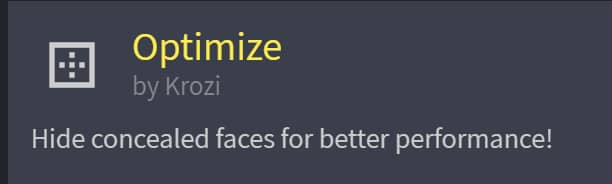
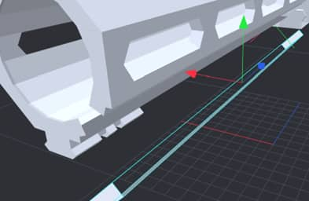
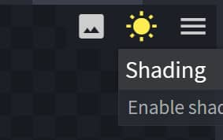
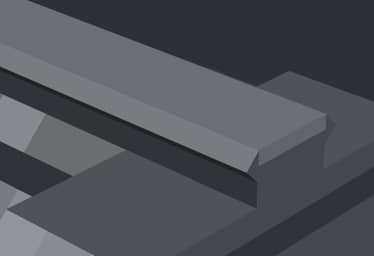
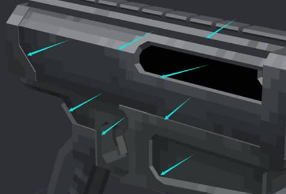
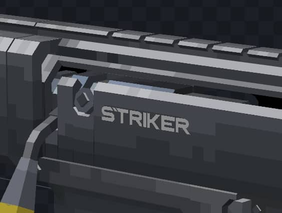

# Part Three · Texturing and Coloring
## Optimizing the Model
### Face Culling
The first step is to optimize the model's face count. We will use the Optimize plugin, which automatically calculates overlapping and invisible faces and removes them. However, ensure you back up your model before face culling and try to operate only on separate parts.

You can install the plugin directly in Blockbench by going to Plugin – Available and searching for Optimize.

Note that the Optimize plugin might encounter errors, such as deleting exposed faces in the Bedrock Edition or Free Model formats. If this happens, quickly undo the operation with Ctrl+Z and check the model. If a part cannot be optimized correctly by the plugin, it is better to manually cull faces or skip culling altogether.

You can find Optimize in the Tools interface. The operation interface looks like this:

The two checkboxes are **Selected Elements Only** and **Apply Face Culling**.

Ensure you check Selected Elements Only, or the plugin will indiscriminately optimize all elements of the model.

When Apply Face Culling is checked, optimization directly removes the UV information of the faces.

Example operation: Optimizing face culling for the handguard
**Be sure to back up your model!
Be sure to back up your model!
Be sure to back up your model!**

Select the skeleton in the outline view and press I to show only that skeleton in the preview.
Select the skeleton, open Tools – Optimize, and check both options.
Apply and check for incorrectly deleted faces. **If there are any, undo the operation or restore from backup.**
If successful, you will see that some faces have been removed.
Proper use of this plugin will reduce face count by 20%-40%, improving game performance.

Repeat these steps to optimize other structures.
You can also manually cull faces in the left UV editing bar. This is suitable for precise culling or supplementing areas the plugin cannot recognize. This button removes the selected UV face.

If a face is deleted incorrectly and the project has progressed too far to restore from a backup, how can you recover it?

Click on the remaining face of the block, go to the UV bar and select the paint bucket icon "Apply to All Faces," which restores the deleted UV face.

If the model already has a texture, the texture will be applied to all faces of the block, which is not ideal for coloring.

You can right-click the model texture and select "Add Element to Template," redistributing the texture across the six faces of the block.

Alternatively, select all or part of the model and regenerate the texture to automatically assign new UVs.

### Z-Fighting
>After optimization, the next step is to solve the model's z-fighting issues. We will use the Inflate function here.

Inflate can take positive or negative values and does not affect the UV face effect of the block. When inflating, pay attention to the coverage relationship between blocks to ensure the desired faces are on top.

Generally, an **±0.001-0.005** inflation value is sufficient.
Fixing z-fighting is done after completing the model because inflated blocks can affect vertex snapping and cause symmetry issues due to floating-point precision in the software.

However, not all z-fighting faces need inflation to prevent overlap. For some less important faces, you can cover the z-fighting effect by painting them the same color.
You can do the same during the coloring process.

## Creating Textures
### Creating Textures
Ensure all blocks and skeletons you want to generate textures for are **visible** and **unlocked** in the outline view.
Then, select Create Texture in the left UV toolbar.

Check the options as shown and create the texture. BB will automatically generate per-face textures and assign UVs. Note that we can only use **per-face textures** because our block volumes are not integers.

### Quick Coloring
Next, we use the paint bucket to quickly color the model with inherent colors.
>Note: When coloring, be sure to **disable the Shadow option** as it interferes with judging inherent colors.

>

Press B to enter paint mode, press Y to select the paint bucket, choose the Color mode for painting in the top bar, select the generated texture in the UV interface, and use the paint bucket to click the UV editor's colors to batch replace them.

For gunmetal colors, the inherent color generally has low saturation and purity, with saturation typically not exceeding 20, ideally between 5-10, and the hue chosen in the blue-cyan range.

For UV texture batch color replacement, the program assigns different colors to faces based on their orientation, such as brighter colors for light-receiving faces. When coloring, you can select brighter colors from the palette.

After batch replacing colors, your gun should look like this:

### Detailing
Now, our model has the most basic light and shadow relationships. Next, we will focus on detailing the texture details between different structures and further refining light and shadow details.

Remember, the main goal of realistic gun coloring is to **highlight and emphasize structures through light and shadow relationships**. Since most guns are generally dark in color, we rely on color contrast to depict volume details.

Let's assume a parallel light source is located in the upper front area of the gun. As a first-person model, we need to understand which light is most likely to reflect off the gun's surface and into our eyes, appearing the brightest;
>As shown, the diagram illustrates the possible lighting effects from the hypothetical light source.

A common technique is:
- The color is brightest on the 45° sloping surfaces facing east and west,
- The top surface is less bright than the slope,
- The vertical east-west surfaces are less bright than the top,
- The north-south surfaces are less bright than the sides,
- The bottom surface is less bright than the north-south surfaces.

For metal surfaces, we generally assume that the brighter the surface, the lower the saturation, and the darker the surface, the higher the purity, also known as **bright and pure, dark and gray**.

It is important to avoid using **pure black or pure white** in surface light and shadow relationships. These colors are only used in special cases, such as using pure black to create a sense of depth.
>For example, painting the inside of a volume black can further enhance the distinction of spatial structures.

Here are some real-world photo examples, but do not simply copy the effects from real photos, as lighting effects vary:

To better distinguish the volume relationships of different parts of the gun, we can use more color layers, including but not limited to **adjusting brightness, saturation, and hue**.

Generally, using appropriate hue differences to distinguish similar-colored parts is effective.

>For example, for the upper and lower receivers, since the lower receiver receives less light, we can adjust the hue towards **light blue and slightly adjust brightness and saturation** to increase differentiation:
This applies to other large structures as well. For color selection, refer to real or in-game photo effects.

So far, we have only used the paint bucket tool to create the basic light and shadow relationship. Next, we will detail the texture based on the basic tone.

Typically, for a vertical surface structure, we can add a gradient effect with brighter top and front surfaces and darker bottom and rear surfaces.

However, **do not use a brush with opacity** for this as it can cause too much color on the surface, creating confusion and breaking the original light and shadow relationship. It can also introduce noise during curve color adjustments due to excessive hues and brightness levels.

To deepen the shadow relationship, pick the current surface color and adjust the value down or lower-right in the color palette; the opposite applies for bright surfaces.

If you feel only two colors create too sharp a contrast, add an intermediate color between the two for a smoother transition.

We can use dithering to blend colors. Dithering is a traditional pixel art technique. You can search online for more detailed information.

In short, the key to emphasizing structure is **contrast at the boundary of light and shadow**.

Using the same method for the lower receiver, we can achieve a similar effect.
Note that dithering is not mandatory. For large flat areas, dithering helps add texture detail and smooth transitions, but for smaller spaces, maintaining fewer, continuous colors can also work well.

>Tip: Transition and Separation of Bright and Dark Surfaces
Adding shadows at the junction of integrated structures can weaken transitions and make structures more closely connected.

Highlight different structures with bright surfaces where separation or transitions are needed.

Sharper transitions typically have greater contrast.

From the light-facing surface to the back, you can create a gradient from light to dark, with dithering to add texture detail.

Larger flat areas can give texture an overall sense of connection, reflecting surface texture due to varying roughness and reflectivity of the metal.

Some parts may have annealed surfaces due to high temperatures, enriching the model's color.

### Programmatic Coloring
You can adjust the hue, contrast, and brightness of textures in the UV workbar.

If the colors are too dark, you can brighten them by adjusting brightness and contrast.

This document does not elaborate on the specific use of contrast, brightness, hue, and RGB curves. Please refer to additional resources as needed.
If unsatisfied with the current local effect, you can generate textures for a specific skeleton and adjust curves separately.

Ensure that created textures do not have multiple duplicate names, as this may cause texture reading errors.
Final colored product:

After completing the model, if it lacks details, we can use another method: surface decals.
Decals are usually logos, inscriptions, or trademarks added according to personal preference.
Here, I will use the following decal:
Copy and import the decal texture file into the project file.

- Note the resolution of the decal and model textures. If the decal resolution is higher than the model texture resolution, you can right-click the model texture and choose "Set Texture Size" to enlarge the texture canvas.

Right-click the model texture and select "Edit in Blockbench."

In the UV work area, use Ctrl+C to copy the decal texture and paste it into the editing texture, select an empty spot, and "Place" it.
It is recommended to place the decal on the edge for easy manual UV adjustment later.
The imported decal texture resolution should be a power of 2 for easier location in the UV texture.

Create a new block and manually delete unnecessary faces.

Drag the texture onto the desired face.

Manually adjust the UV, ensuring the decal resolution matches the block's aspect ratio. For example, if the block aspect ratio is 4:1, the decal UV resolution should be a multiple of 4:1.

Effect display:

At this point, your model is basically complete.
