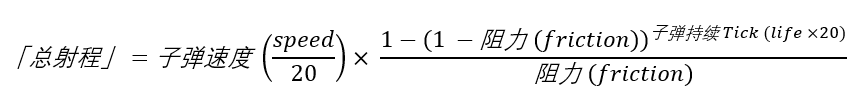

# 额外伤害
在之前的 [添加第一把枪](/zh/gunpack/first_gun/) 教程中，我们跳过了一个子弹属性——额外伤害属性。   
额外伤害属性用于定义枪的：护甲穿透率 (原版护甲)、爆头伤害倍率、远距离伤害衰减、抵近射击伤害倍率。  
事不宜迟，让我们为教程枪添加额外伤害属性。   
在 guns/data/ak47_data.json 中，找到 "bullet" 子项，并向其中添加如下代码:   
``` json
    "extra_damage": {
      // 护甲穿透率，50% 穿透率，意为忽略 50% 的护甲值。
      "armor_ignore": 0.5,
      // 爆头伤害倍率，2倍。
      "head_shot_multiplier": 2,
      // 远距离伤害衰减
      "decay": {
        // 从「总射程」的 14% 开始衰减，到「总射程」的 30% 伤害降为最小值
        "range_percent": [
          0.14,
          0.3
        ],
        // 最小伤害，原伤害的 30%
        "min_damage_multiplier": 0.3
      },
      // 抵近伤害
      "close": {
        // 范围 2 格内算抵近射击
        "range_meters": 2,
        // 伤害倍率 110%
        "damage_multiplier": 1.1
      }
    }
```
其中，枪械的射程程序会自动计算。计算式为：   
   
其中参数 speed、life 和 friction 来自第一章中枪械数据文件的定义。   
算式中的子弹速度的单位是 格/tick，而 speed 参数的单位是 格/秒，因此子弹速度 = speed / 20。同理，子弹持续Tick = life * 20。   
最后，你的枪械数据文件应该看起来像这样:    
``` json
{
    ...
    "bolt": "closed_bolt",
    "rpm": 600,
    "bullet": {
      "extra_damage": {
        "armor_ignore": 0.5,
        "head_shot_multiplier": 2,
        "decay": {
          "range_percent": [
            0.14,
            0.3
          ],
          "min_damage_multiplier": 0.3
        },
        "close": {
          "range_meters": 2,
          "damage_multiplier": 1.1
        }
      },
      "life": 10,
      "damage": 6,
      "speed": 400,
      "gravity": 0,
      "knockback": 0,
      "friction": 0.01,
      "ignite": false,
      "pierce": 2
    },
    ...
}
```