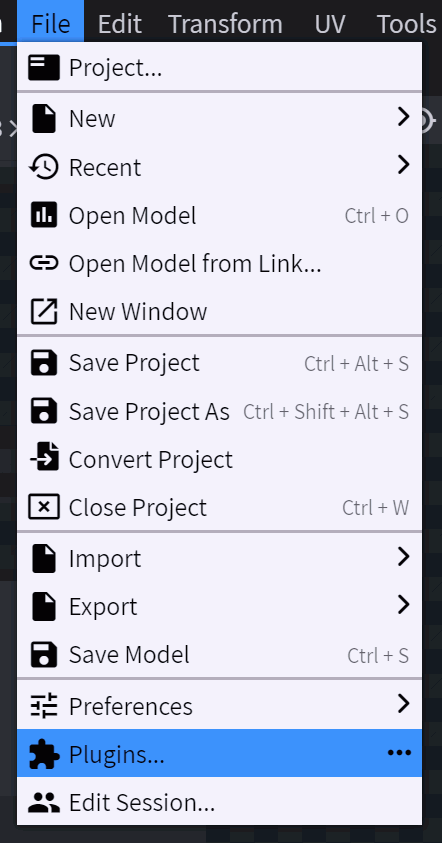
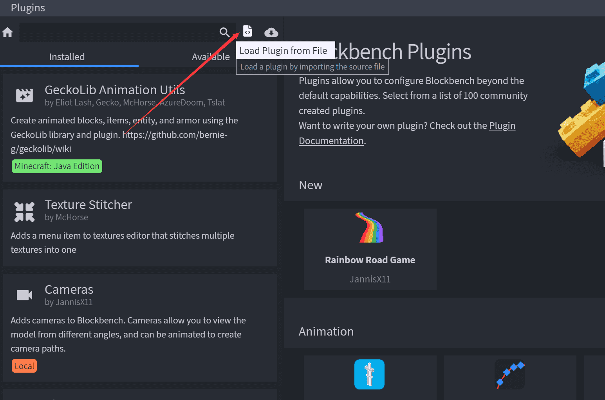

# 调整枪械模型定位组
::: tip
你可以在 [这里](/zh/model/#模型定位组) 查看所有模型定位组的效果。
:::
### 为 BlockBench 安装 cameras 插件
模型定位组的调整需要依赖 cameras 插件。   
你可以从 [这里](https://github.com/JannisX11/blockbench-plugins/blob/master/plugins/cameras.js) 下载 cameras 插件。
按照如下步骤将 cameras 安装到你的 BlockBench。   
   
   