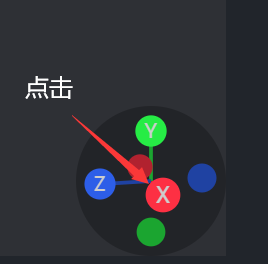
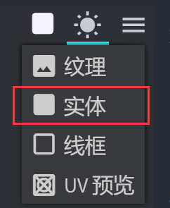
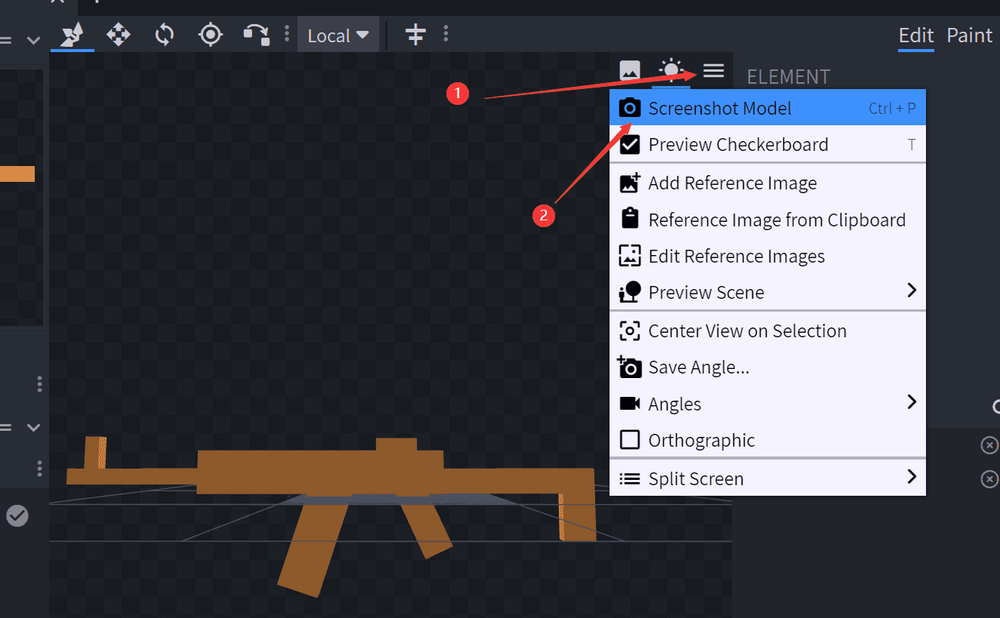

# 为枪械创建 HUD Icon
我们可以使用 BlockBench 提供的 Screenshot Model 功能获取到枪械模型的平面图。  
使用bb编辑模式右下角的游标视图，点击选中侧视图（通常为西或东）  
  
按z或在右上角图标中切换模型的显示模式，使模型显示为【实体】。此时模型在工程文件中应显示为白色。    
  
按下Ctrl+P 进行截图并保存当前图片为.png格式  
     
模组要求 HUD Icon 满足以下两点：   
- 图片长宽相等，且尽可能为 2 的整数次方
- hud 有改色渲染需求，因此提供的原图应该为白色   

因此，接下来，你应该使用图片处理工具，按照需求处理平面图。   
如果你懒得自己动手，你可以到 [这里](https://github.com/MCModderAnchor/tacwiki/tree/main/resource/hud_icon) 获取已经处理好的图片。   
接下来，我们将平面图置于枪包的 textures/gun/hud/ 目录下，并在 guns/display/ak47_display.json 文件中指定它。   
此时你的文件结构应该看起来像:   
```
tutorial_gun_pack
└─ tutorial
   ├─ pack.json
   ├─ textures
   │  └─ gun
   │     ├─ uv
   │     │  └─ ak47.png
   │     ├─ slot
   │     │  └─ ak47.png
   │     └─ hud
   │        └─ ak47.png
   ├─ models
   │  └─ gun
   │     └─ ak47_geo.json
   └─ guns
      ├─ index
      │  └─ ak47.json
      ├─ display
      │  └─ ak47_display.json
      └─ data
         └─ ak47_data.json
```
在 ak47_display.json 中加入一行   
``` json
    "hud": "tutorial:gun/hud/ak47",
```
此时你的 ak47 效果文件应该看起来像：   
``` json
{
    "model": "tutorial:gun/ak47_geo",
    "texture": "tutorial:gun/uv/ak47",
    "slot": "tutorial:gun/slot/ak47",
    "hud": "tutorial:gun/hud/ak47",
    "third_person_animation": "default"
}
```
进入游戏后，若你看到原本显示在 hud 的黑子块变成你的平面图，则证明你成功为枪械添加了 hud icon。   
   
你也可以尝试将子弹打空，hud 中的平面图将变为红色。   
   