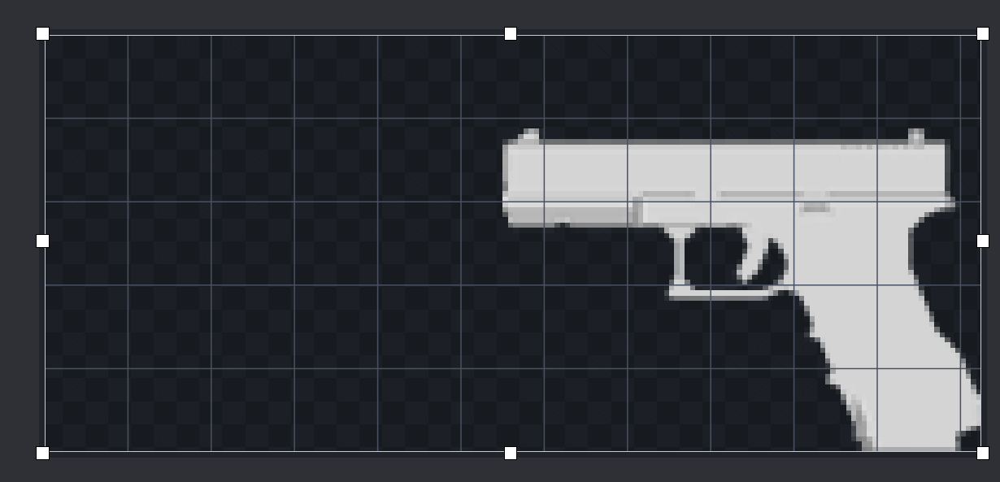
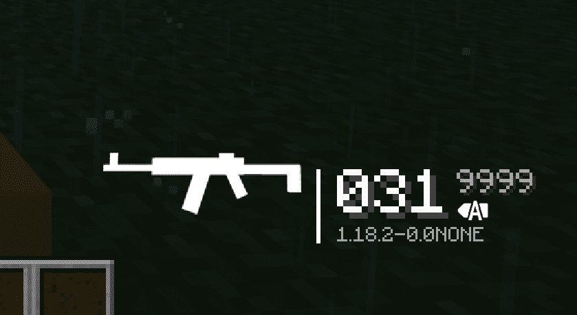

# 为枪械创建 HUD Icon
### 使用 BlockBench Screenshot Model 取得枪械侧视图
我们可以使用 BlockBench 提供的 Screenshot Model 功能获取到枪械模型的平面图。    
1. 使用右下角的游标视图，点击合适的轴得到枪模的侧视图。   
::: tip
在默认枪械包中，我们通常让侧视图中的枪口朝左。这样能获得做好的视觉效果。   
:::
  
2. 按z或在右上角图标中切换模型的显示模式，使模型显示为【实体】。此时模型在工程文件中显示为白色。    
  
3. 按下Ctrl+P 进行截图并保存当前图片为.png格式    
   
  
这样，我们就得到了一个纯白色的枪械模型侧视图。
### 处理枪械侧视图为 HUD Icon
HUD Icon 渲染的长宽比例为 3:1。所以如果你不希望你提供的枪械侧视图被拉伸，你应该用图片处理工具对侧视图进行缩放、裁剪，得到长宽像素比为 3:1 的图片。   
由于 HUD Icon 不需要很精细的图片，我们可以将图片适当缩小，以下是几种推荐的分辨率: 180x60、192x64、384x128 。   
通常图片元素对齐中间轴线即可，例如：   
   
对于更短的枪械如手枪，则需将图片向右对齐，如图：   
  
如果你懒得自己动手，你可以到 [这里](https://github.com/MCModderAnchor/tacwiki/tree/main/resource/hud_icon) 获取已经处理好的图片。   
接下来，我们将平面图置于枪包的 textures/gun/hud/ 目录下，并在 guns/display/ak47_display.json 文件中指定它。   
此时你的文件结构应该看起来像:   
```
tutorial_gun_pack
└─ tutorial
   ├─ pack.json
   ├─ textures
   │  └─ gun
   │     ├─ uv
   │     │  └─ ak47.png
   │     ├─ slot
   │     │  └─ ak47.png
   │     └─ hud
   │        └─ ak47.png
   ├─ models
   │  └─ gun
   │     └─ ak47_geo.json
   ├─ lang
   │  └─ en_us.json
   └─ guns
      ├─ index
      │  └─ ak47.json
      ├─ display
      │  └─ ak47_display.json
      └─ data
         └─ ak47_data.json
```
在 ak47_display.json 中加入一行   
``` json
    "hud": "tutorial:gun/hud/ak47"
```
此时你的 ak47 效果文件应该看起来像：   
``` json
{
    "model": "tutorial:gun/ak47_geo",
    "texture": "tutorial:gun/uv/ak47",
    "slot": "tutorial:gun/slot/ak47",
    "hud": "tutorial:gun/hud/ak47",
    "third_person_animation": "default"
}
```
进入游戏后，若你看到原本显示在 hud 的黑紫块变成你的平面图，则证明你成功为枪械添加了 hud icon。   
   
你也可以尝试将子弹打空，hud 中的平面图将变为红色。   
   