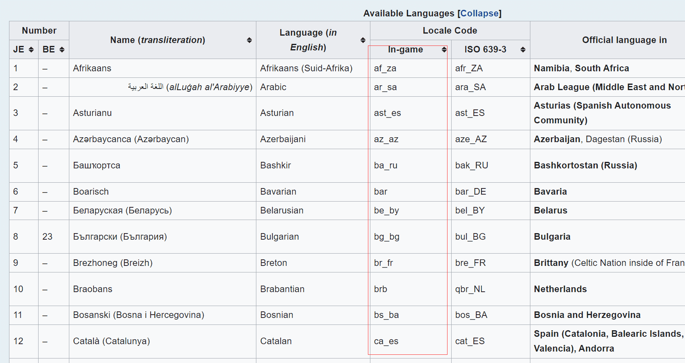

# 创建并使用语言文件

**语言文件**是 Minecraft 中用于存储文本的文件，用于将游戏中的文本翻译成不同的语言。在枪包中，我们可以使用语言文件来定义各种名称和描述文本。  

要使用**语言文件**，我们需要在枪包命名空间文件夹下建立文件夹 `lang/` ，并新建文件对应语言的语言文件 `<语言代码>.json`

以英语为例，我们新建了一个名为`en_us.json`的文件，此时，你的枪包文件结构应看起来像这样：   
```
tutorial_gun_pack
└─ tutorial
   ├─ lang
   │  └─ en_us.json
   └─── pack.json

```

Minecraft 的默认语言为英语，即对应文件 `en_us.json`。  

如果客户端使用的语言对应的语言文件不存在，则自动启用 en_us.json；如果当前使用的语言文件中某个词条不存在，也将从 `en_us.json` 中寻找词条代替。  

:::tip
作为一个中文母语使用者，我们至少应该需要提供 `en_us.json`（英语） 和 `zh_cn.json`（中文） 两个语言文件  
:::
:::caution
诚然，事实上我们的确可以直接向 `en_us.json` 中添加中文译文，但是这样做是非常不规范的，故我们强烈不推荐这么做
:::

你可以在 [这里](https://zh.minecraft.wiki/w/%E8%AF%AD%E8%A8%80) 看到 Minecraft 支持的所有语言类型。  
其中，下图框出的 **代码-游戏内** 一列即为我们所需的对应语言的语言代码。  
   
接下来，让我们在 **语言文件** 中定义枪包的名称和描述文本。  
在 `en_us.json` 文件中添加:   
```json
{
  "pack.tutorial.name": "Tutorial Gun Pack",
  "pack.tutorial.desc": "Just a gun pack for tutorial."
}
```