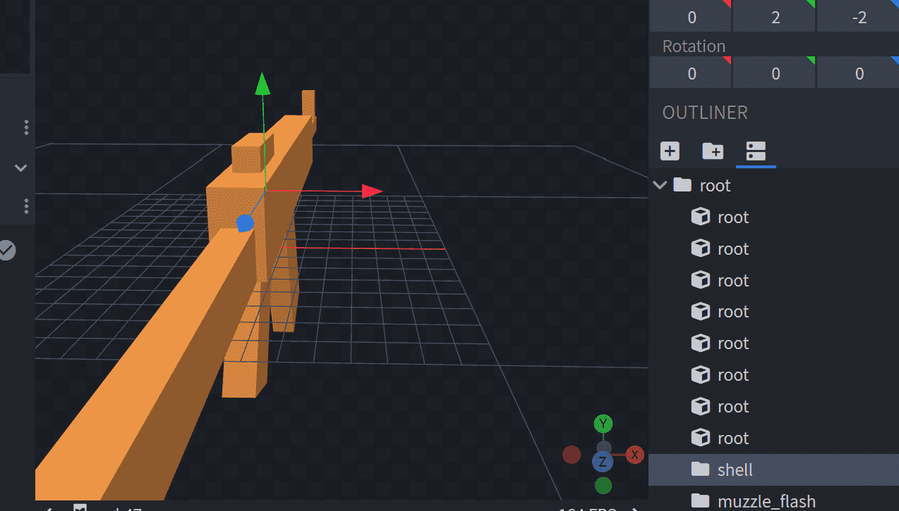

# 抛壳
在上一章中，我们制作好了弹药的弹壳模型并导入了枪包，但是我们必须在枪械模型和枪械效果文件里进行一些额外设置，抛壳才能渲染出来。   
### 放置抛壳窗定位组
首先，我们需要在枪械模型中放置一个抛壳窗定位组。抛壳窗定位组的名称固定为 shell。   
::: tip
抛壳窗定位组会受到枪械动画的影响，你需要确保抛壳窗定位组和抛壳窗模型在同一个分组下，这样它们可以受到相同的动画效果。   
:::
   
### 配置抛壳参数
抛壳参数在枪械效果文件中设定。   
在 guns/display/ak47_display.json 中添加如下代码:   
``` json
    // 抛壳的渲染数据，可为空，若为空，则枪械不抛壳
    "shell": {
        // 抛壳的初速度的 xyz 值
        "initial_velocity": [5, 2, 1],
        // 抛壳随机变化的运动速度 xyz 值，从 0 ~ 1 随机缩放后叠加在初速度上。
        "random_velocity": [1, 1, 0.25],
        // 抛壳的加速度
        "acceleration": [0.0, -10, 0.0],
        // 抛壳的三轴角速度，从 0.5 ~ 1 随机缩放。
        "angular_velocity": [360, -1200, 90],
        // 抛壳渲染存活时间，单位为秒
        "living_time": 1.0
    },
```
最后，进入游戏看看效果吧。   
