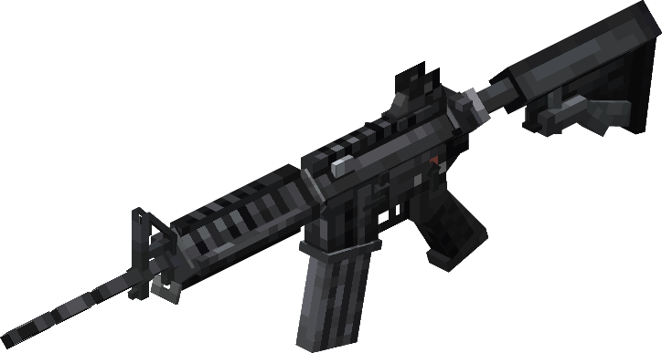

# 降低渲染压力的低精度模型

由于枪械模型的精度普遍较高，动辄几百块的模型对于游戏来说是会带来很大的渲染压力，尤其是很多玩家喜欢把枪挂在墙上，这样枪一多就会导致非常恐怖的性能占用，为了解决这一点，我们可以使用低精度模型用作展示。低精度模型不是必须的，但是推荐做了以减缓游戏压力。
::: tip
低精度模型的适用场景：第三人称手持，物品展示框内，以掉落物的形式出现在地面上
高精度模型的适用场景：第一人称手持，枪械制作台里旋转展示
:::

## 枪械的低精度模型



::: tip
低精度模型的块数不宜太多，控制在50以内是极好的
:::
当你完成了低精度模型的建模时，导出基岩版模型和相关贴图，这里以 m4a1 为例。
::: tip
做自己的低精度模型时在命名上不要和高精度模型搞混了，建议低精度模型的模型和贴图都加上"_lod"的后缀
:::

### 给lod建模

比较推荐的方法是复制一份高精度模型然后对照着做

::: tip
低精度模型也应该保留各个定位组
[调整枪械模型定位组](/zh/gunpack/gun_positioning/)
由于不在第一人称渲染，因此不需要第一人称的手臂定位组
:::

### 添加lod

此时你应该已经有了如下材料：

- 低模：m4a1_geo.json
- 贴图：m4a1.png

1. 找到 models/gun 目录，创建一个新的文件夹 lod ，把 m4a1_geo.json 放进去
2. 找到 textures/gun 目录，创建一个新的文件夹 lod ，把 m4a1.png 放进去

此时你的目录视图应该是这样的：

```
tutorial_gun_pack
└─ tutorial
   ├─ textures
   │  └─ gun
   │    └─ lod
   │      └─ m4a1.png
   ├─ models
   │  └─ gun
   │    └─ lod
   │      └─ m4a1_geo.json
```

### 修改枪械效果文件

找到你的枪械效果文件（guns/display目录下），这里还是以m4a1为例，找到 m4a1_display.json 并往里面添加以下内容：

```json
//调用低模
    "lod": {
        //你的低精度模型路径
        "model": "tutorial:gun/lod/m4a1_geo",
        //你的低精度模型贴图路径
        "texture": "tutorial:gun/lod/m4a1"
    }
```

做完这些后启动游戏（或者游戏内使用 /tacz reload ）。
如果你看到如下画面，证明枪械低精度模型添加成功了。


