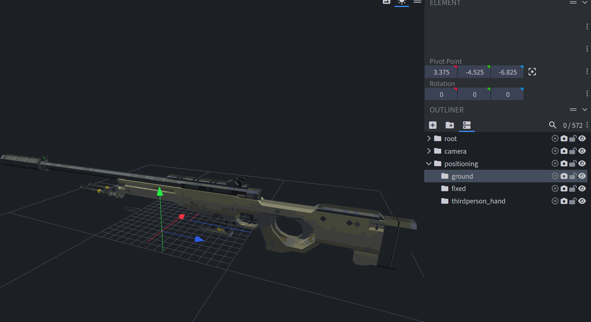
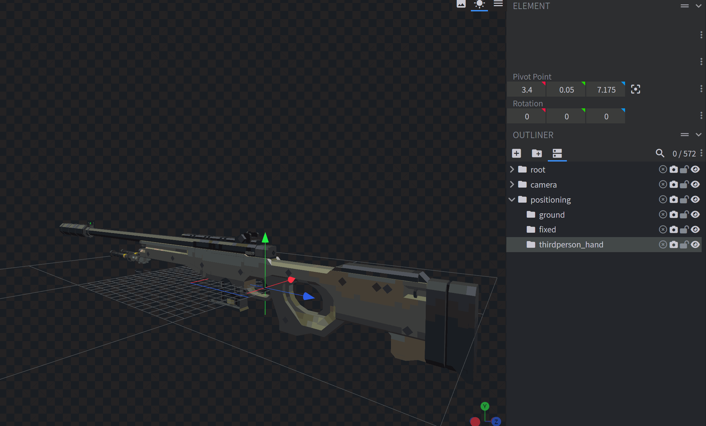
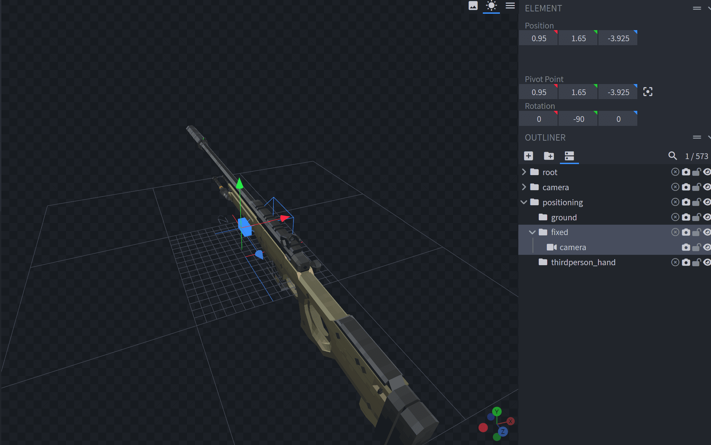
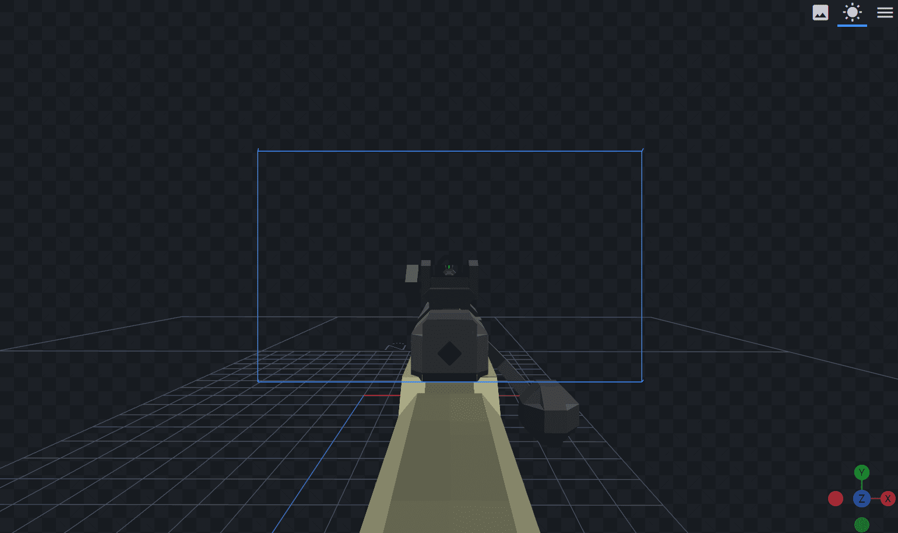
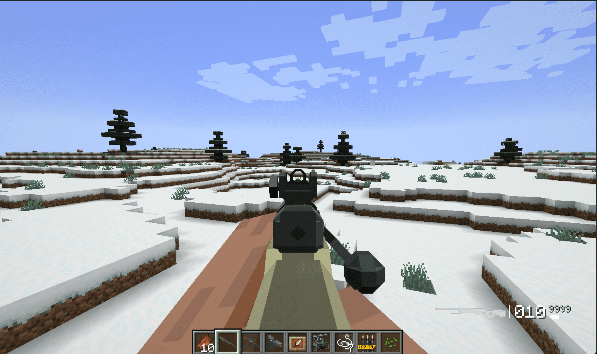

# Timeless and Classics Zero 枪械模型说明文档

推荐使用的模型编辑软件: [Blockbench](https://www.blockbench.net/)

相关资源:

- 推荐的 Blockbench 插件：[cameras](https://github.com/JannisX11/blockbench-plugins/blob/master/plugins/cameras.js)。可用于第一人称摄像机定位组的效果预览、摄像机动画效果预览等。
- 推荐的 Blockbench 插件：tac_gunpack_builder。开发中。

以下教程使用模型编辑软件 Blockbench 进行示范。

### cameras 插件使用方法

选中需要添加摄像机的分组，点击导航栏Edit -> Add Camera。

模型渲染视图的右上角有一个三个横线的icon，点击展开后，选中link camera to preview，即可将视角绑定在摄像机上。

### 受程序控制的分组

tac:zero 提供了一套默认的程序逻辑，帮助枪包作者更加便捷地完成一些细节效果。

如果以以下名称对枪械模型的分组进行命名，它们将会受到默认的程序脚本控制。每个部件受到的具体影响见下表。

| 分组名           | 效果                             |
| ------------------ | ---------------------------------- |
| bullet_in_barrel | 枪膛内子弹，当枪膛内有子弹时渲染 |
| bullet_in_mag    | 弹匣内子弹，弹匣中有子弹时渲染   |
| bullet_chain     | 一般见于机枪，枪上仍有子弹则渲染 |
| carry            | 一般见于m4，安装瞄具后隐藏       |
| mount            | 镜桥，安装瞄具后渲染             |
| sight            | 机械瞄具，安装瞄具后隐藏         |
| sight_folded     | 折叠的机械瞄具，安装瞄具后渲染   |
| mag_standard     | 标准弹匣，未扩容时渲染。         |
| mag_extended_1   | 1级扩容弹匣，扩容时渲染          |
| mag_extended_2   | 2级扩容弹匣，扩容时渲染          |
| mag_extended_3   | 3级扩容弹匣，扩容时渲染          |

另外，任意分组如果以_illuminated结尾，则会以满亮度渲染，以提供荧光效果。

### 受到动画影响的分组

| 分组名     | 效果                                                                                                                                                                                                     |
| ------------ | ---------------------------------------------------------------------------------------------------------------------------------------------------------------------------------------------------------- |
| camera     | 摄像机动画分组。程序会读取动画储存于该分组的旋转数据，并应用于玩家摄像机                                                                                                                                 |
| constraint | 动画约束组。程序约定在动画播放时，该组的公共坐标尽可能不改变、公共旋转尽可能减弱。位移和旋转的削弱程度由[ica]() 决定                                                                                     |
| root       | 根组。它应当是所有模型分组的根。tac:zero会提供一套默认的动画，包括跑步动画、行走动画、瞄准动画、开火抖动。当你的动画文件不包含相应动画时，这些默认的动画会应用在root组，并以你指定的枢纽点作为旋转中心。 |

你可以添加一个 cameras 插件提供的摄像机，于 camera 分组下，对摄像机动画进行预览。

### 模型定位组

以下是第三人称模型定位组，可以置于任意位置。可以任意增加旋转。

| 分组名           | 效果                                                                           |
| ------------------ | -------------------------------------------------------------------------------- |
| ground           | 指示枪械被丢于地面时，渲染模型的原点。一般于枪械纵深轴的中央、枪械垂直轴的下端 |
| fixed            | 指示展示框中模型的渲染原点。详细说明见下图                                     |
| thirdperson_hand | 指示在实体手上渲染时的渲染原点。一般位于枪械后握把                             |

- 以 ai_awp  为例，ground 组的位置：

- 以 ai_awp 为例，thirdperson_hand 的位置：

- 以 ai_awp 为例，cameras 插件辅助，fixed的位置和旋转：

::: tip
摄像机朝向即为展示框的正面朝向。
::: 

以下是第一人称摄像机定位组，可以位于任意地方，应用任意旋转。

| 分组名    | 效果                 |
| ----------- | ---------------------- |
| iron_view | 机瞄视角定位组。     |
| idle_view | 普通持握视角定位组。 |

需要配合 cameras 插件进行定位，直接向相应的定位组中添加摄像机，通过摄像机能直接对枪械模型在视角中的位置进行预览。

如，ai_awp 中的 iron_view 定位组效果: 

