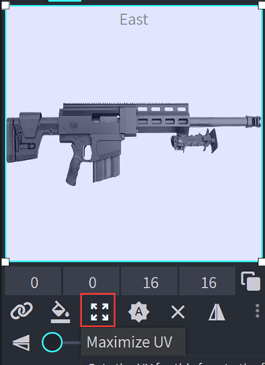
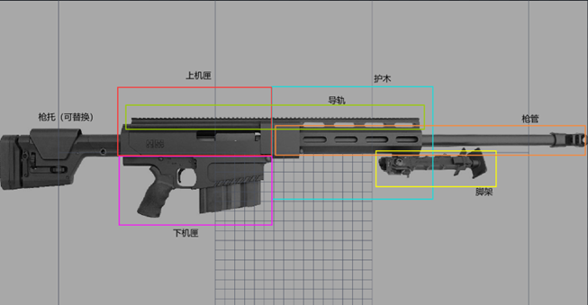
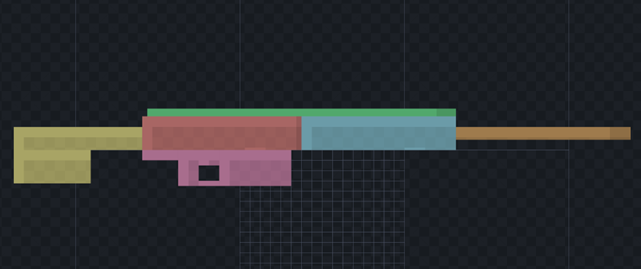
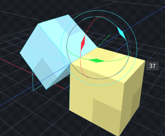
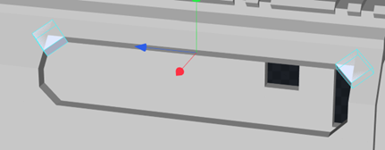
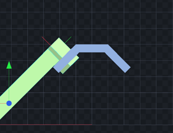

# 第二部分 · 创建您的项目
## 建造准备
**我们假设您已经了解Blockbench的基本建模操作，如基本热键的使用和功能的理解。如果没有，请[点击这里](https://youtu.be/XqzxL_-XjA0)查看基本操作。**

为了确保您提交的模型与MOD默认所使用的各种模型比例相同，我们要求您了解您正在制作的枪的真实数据，比如总长度等。这些数据可以通过谷歌搜索或者在对应的官方网站找到。

请注意，同一种枪不同的型号会有不一样的长度，枪械部件的折叠/伸出也会导致参考图的总长发生变化。请确保您所使用的参考图与您的数据是对应的。

对于枪械，我们使用以下比例作为标准模型比例：**1000mm=48 grid**
例如，1000mm的步枪可以通过下列式子计算：
x=48*L/1000
其中，x表示网格长度，L为实际总长。

**为了使您的工作更准确，我们要求您导入一个枪支的侧视图作为参考。**

**实操例子讲解：**
例如，要建造一把HM 50B 步枪，我们首先要找到一个.png文件，您可以在谷歌或其他搜索引擎找到合适的侧视图：

**请裁剪参考照片，使其左右两侧没有留白（枪口与枪托与图片的边框之间没有留白）。**
经过换算可以得到模型全长应为70 grid，我们将在工程中新建一个参考方块平面用于放置参考图
>Tips：请注意，平面的方向设置为长边朝向南北。

之后，请根据图片的分辨率调整参考方块的长宽比，保持两者长宽比一致，以免出现拉伸。
>例如，该图片的分辨率为1332 x 700，则方块对应的长宽比为60 x 31.5315
>之后，拖拽.png文件到您想要的平面，并最大化UV使贴图铺满整个平面。

点击右下角的坐标轴点，可以使视图平行于所选法向。

在开始建造前，前往大纲视图，请点选【更多选项】并点选【锁定】以取消该参考方块的可选，以避免意外移动参考方块。

做完以上步骤，现在，您可以好好观察您的参考图片并进行建造了。
>Tips：您也可以使用blockbench自带的参考图功能添加其他角度的参考图，但建模的主要参考图必须使用方块贴图，以提供更准确的参考。
>

## 建造讲解（局部）
现在，请按下Ctrl+N为您的模型创建第一个立方体模型。
**请注意，您的模型必须是关于Z-Y平面对称的，这意味着您创建的锚定立方体必须位于中轴N↑上。确保模型关于中心轴对称有助于标准化建造。**

**枪管朝向必须为N↑方向。**

您可以选中方块后点击 X轴居中按钮确保该方块位于中轴线

我们建议您在调整方块的大小数值时将调整单位控制在**0.125**的倍数， 这在生成UV时能够得到更统一的UV像素尺寸，以及更容易通过移动和缩放操作对齐方块。

通过观察结构，我们可以发现该枪由几个基础部件构成：

因此，我们先使用不同颜色的概括体块对枪械的结构部件进行分类。
>Tips：选中已有的方块按Ctrl+D可以快速复制，按住alt拖动方块的体积操作柄可以在两侧同时增加体积

之后，每个部件将会单独成骨骼，并给予命名

在侧视图下按住Ctrl键+鼠标左键可以进行框选，使用Ctrl+G可以快速将方块归位一骨骼。
你也可以手动将方块在大纲视图里拖入指定的骨骼。选中骨骼后按下F2可以快速重命名骨骼。

现在，我们已经将所有的体积归类分骨骼了，接下来就可以开始细化每个结构部件的细节。

对于目前不需要进行更改的骨骼，我们可以在大纲视图中点选【可视性】图标（眼睛）将其隐藏，或**Shift+左键** 点选需要显示的骨骼后，按下热键 I 一键隐藏所有没有被选择的骨骼。

如何确定枪械部件的宽度呢？我们可以借助枪械上有标准尺度的结构来进行交叉对照比较，例如导轨和握把：

导轨在模型中的底部宽度永远为0.75 grid，握把的通常宽度在1.5-2 grid之间，因此可以目测出其他部件的大致宽度

总之，在模型的建造过程中，不要过于依赖侧视图。应当主动去寻找更多角度的图片以供参考，并还原出枪械整体的比例关系

Blockbench的顶点捕捉功能可以对齐块的边/顶点，而不会产生奇怪的间隙。

**移动功能可以将整个方块移动至所选顶点处**

**捕捉功能可以将方块体积变换至所选顶点处**

还可以对枢轴点进行顶点捕捉移动的操作，可以将枢轴放置于方块的边，以进行绕该边为轴的旋转操作。

>Tips：若要连接一些斜面，可以使用顶点捕捉的**缩放模式**，该模式下方块会被自动拉伸至顶点重叠。这种功能在进行45度倒角的建造时非常有效
>
>

>Tips：复制当前已有的方块并进行变换要比新建方块更快，因为不需要额外的拖移，同时还能保持颜色分骨骼的一致。
>
>
>

>Tips：将正方体的中心枢轴置于直角处再进行旋转操作有助于创建遮盖良好的倒角
>
>

>Tips：在旋转的同时按下ctrl，shift，ctrl+shift，可以旋转不同的角度间隔。
要创建在斜面上的倒角，可以直接复制斜面方块进行同样的倒角操作。
>
>

在这个部件中，顶部还包含了导轨
导轨需按照统一标准建造（该标准适用于48/1000 mm比例）：

关于导轨的建造，出于优化的考虑，我们会进行主观处理；

通常来说，以0.25作为一个导轨单位，间隔0.25单位，1-3-1和1-5-1两种是常用的导轨建造方式，后者通常用于更长全长的导轨。我们建议更多地使用151型导轨，可以达到更优化的面数。

当然，采用为韦弗式（Weaver rail）导轨的样式也可以有效减少面数。

最后，对各处的细节进行修改，最终可以完成这个部件的建造：

**特殊活动部件：两脚架**
由于两脚架绕轴旋转，该轴可能本身有一定的倾角，所以我们需要借助骨骼旋转轴来完成。

在创建两脚架模型时，你需要单独创建一个位于竖直或水平方向，无任何旋转的单个脚架模型。

将模型的所有部件放入一个新建的单独的骨骼中。选中这个骨骼的枢轴，将其调整到脚架支架的旋转轴位置

接下来先对骨骼进行z轴（蓝色）旋转，将它的旋转轴点贴合到想要的平面上

之后再进行x轴（红色）旋转，就可以得到一个骨骼绑定正常的两脚架了

另一侧的脚架可以对当前的骨骼进行Ctrl+D复制，再翻转x轴的得到。

当您完成了模型所有结构部件的制作之后，我们需要为其设置正确的骨骼名称让程序自动识别，以及添加摄像机与定位骨骼以便后续开发使用。
[骨骼名称](/zh/model/)

## 2.4.	注意事项
现在，您可以按照自己喜欢的方式建造模型，但仍有几点需要注意。
**1)	Z-fighting**
由于模型只能用立方体模型建造，某些立方体会不可避免地交叉。交叉面会导致该处贴图闪烁，因此请尽量减少交叉区域。

其次，通过Inflate（膨胀）可以将该方块体积些许增加，让两个面不在重叠，请善用该功能。通常来说，0.001-0.005的膨胀可以在不影响方块视觉的情况下解决z-fighting问题。

对于互相垂直的立方体，请尽量防止它们交叉。这样可以减少在上色阶段的Z-fighting问题。

**2)	圆的表达**
为了保证一定程度的Minecraft风格，我们用八边形替换了大部分的圆，比如枪管和瞄具。通常半径大于1的圆可以使用八边形

对于更细小的圆形，例如**小于0.75或0.5**的结构，我们可以使用单个方块来代替。

对于一些半径相对较大的圆，我们仍可使用十六边形来替代，例如弹鼓
您可以使用Shape Generator插件快速生成几何体。
请尽可能使用实心圆而非空心圆（例如枪管等部位），来达到优化的目的。

